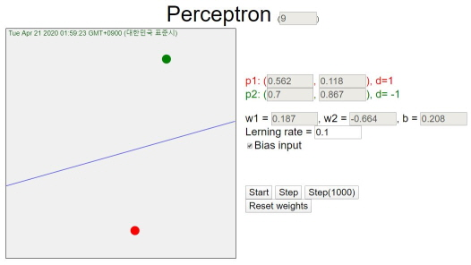

# Perceptron
* Perceptron (html & JavaScript)
* Perceptron.html

## Introduction
* Single perceptron
* No activation function
* Two inputs, two train data, bias input (optional), learning rate
* Hyperplane is shown

## Explain
* Start: generating two train data (desired output: 1 and -1) with two featrues ranging [0, 1] 
* Step: training by each train data, alternately
* Updated by w1(t+1) = w1(t) + η(d-y(t))x1(t), where y = w1x1 + w2x2 + b
* [View](https://nize-vision.tistory.com/1) 
  </img>  
